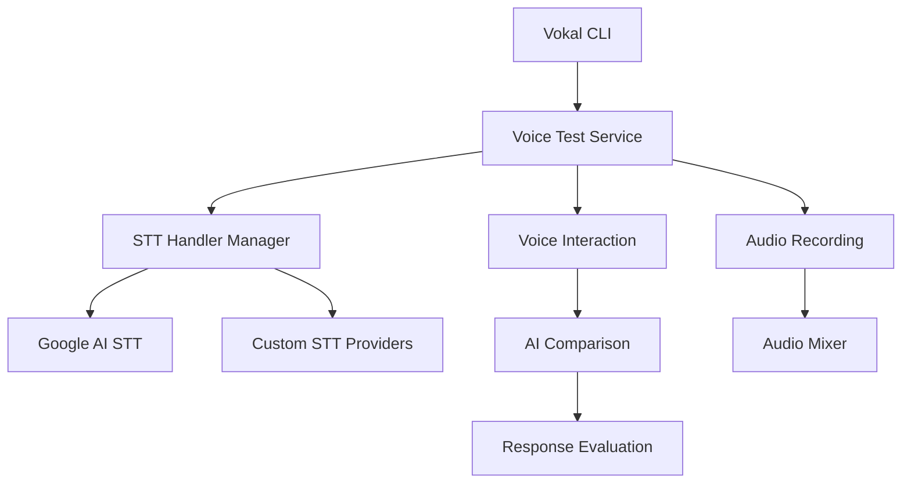

# API Overview

This section provides comprehensive documentation for the Vokal API.

## Core Components

Vokal is built around several key components that work together to provide a complete voice bot testing framework:

### Voice Test Framework

The main entry point for running voice bot tests with various configurations and providers.

### STT (Speech-to-Text) Providers

Support for multiple STT providers:

- **Google Cloud Speech-to-Text**
- **Extensible provider system** for adding custom STT handlers

### TTS (Text-to-Speech) Support

Integration with TTS services for generating voice inputs.

### Audio Processing

- Audio recording and playback
- Audio mixing with background noise
- Real-time audio streaming

### AI Evaluation

- Multiple AI model support for evaluating responses
- Response comparison and analysis
- Scoring and metrics

## Architecture



## Module Structure

```
vokal/
├── cli/              # Command-line interface
├── services/         # Core services
│   ├── voice-test.ts
│   ├── voice-bot-test.ts
│   ├── voice-interaction.ts
│   ├── ai-comparison.ts
│   ├── audio-mixer.ts
│   └── audio-recording.ts
├── providers/        # STT provider implementations
│   ├── stt-handler-manager.ts
│   ├── stt-registry.ts
│   └── google-ai-stt.handler.ts
├── types/           # TypeScript type definitions
└── utils/           # Utility functions
```

## Key Concepts

### Voice Bot Configuration

Vokal uses a configuration file to define:

- Test scenarios
- STT/TTS provider settings
- AI evaluation parameters
- Audio settings

### STT Handler System

The extensible STT handler system allows:

- Registration of custom STT providers
- Dynamic handler selection
- Streaming and batch processing support

### Test Scenarios

Define test cases with:

- Input prompts
- Expected responses
- Background noise settings
- Evaluation criteria

## Next Steps

- [Methods Reference](methods.md) - Detailed API methods
- [Type Definitions](types.md) - TypeScript types and interfaces
- [Examples](../user-guide/examples.md) - Code examples
