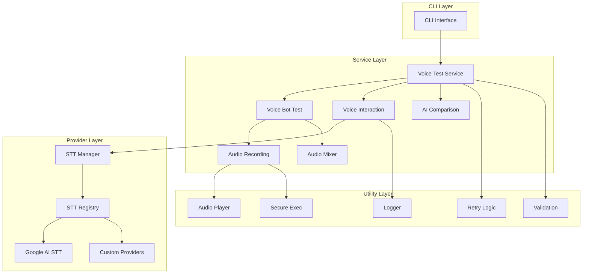
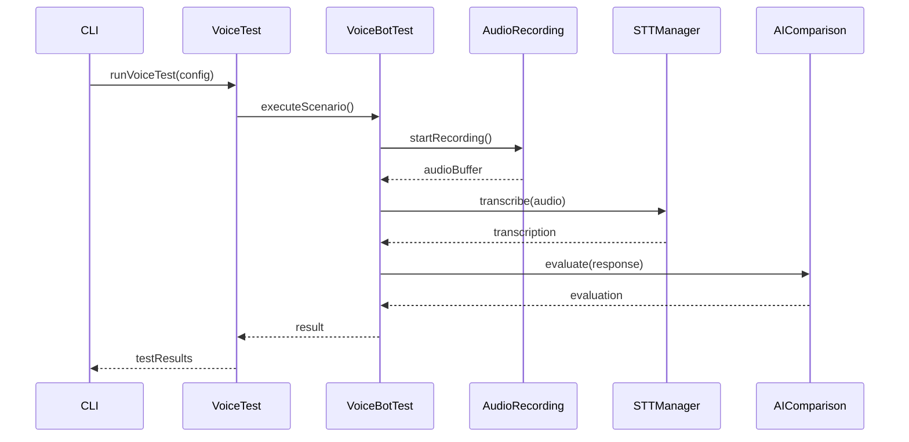
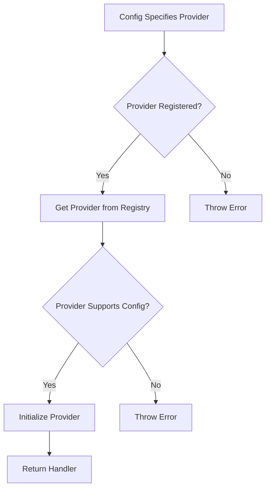

# Architecture

This document describes the architecture and design principles of Vokal.

## Overview

Vokal is designed as a modular, extensible voice bot testing framework with clear separation of concerns.



## Core Principles

### 1. Modularity

Each component has a single, well-defined responsibility:

- **Services**: High-level business logic
- **Providers**: STT/TTS integrations
- **Utils**: Reusable utility functions
- **Types**: Shared type definitions

### 2. Extensibility

The provider system allows easy addition of new STT/TTS providers:

```typescript
// Register a custom provider
registerSTTHandler('my-provider', new MySTTProvider());
```

### 3. Type Safety

TypeScript is used throughout for compile-time safety and better developer experience.

### 4. Error Handling

Comprehensive error handling with custom error classes:

- `VoiceTestError`
- `STTProviderError`
- `AudioRecordingError`
- `ValidationError`

## Component Details

### CLI Layer

**Location**: `src/cli/`

The CLI provides a command-line interface for running tests:

```typescript
vokal test -c config.json -v
```

**Responsibilities**:
- Parse command-line arguments
- Load configuration
- Invoke test services
- Display results

### Service Layer

#### Voice Test Service

**Location**: `src/services/voice-test.ts`

Main orchestrator for running voice tests.

**Responsibilities**:
- Coordinate test execution
- Manage test lifecycle
- Aggregate results

#### Voice Bot Test

**Location**: `src/services/voice-bot-test.ts`

Handles individual test scenario execution.

**Responsibilities**:
- Execute test scenarios
- Record audio responses
- Transcribe audio
- Evaluate responses

#### Voice Interaction

**Location**: `src/services/voice-interaction.ts`

Manages voice interactions with the bot.

**Responsibilities**:
- Play prompts
- Record responses
- Handle streaming audio

#### Audio Recording

**Location**: `src/services/audio-recording.ts`

Handles audio recording operations.

**Responsibilities**:
- Start/stop recording
- Detect silence
- Buffer audio data

#### Audio Mixer

**Location**: `src/services/audio-mixer.ts`

Mixes audio with background noise.

**Responsibilities**:
- Load background noise files
- Mix audio streams
- Adjust noise levels

#### AI Comparison

**Location**: `src/services/ai-comparison.ts`

Evaluates responses using AI models.

**Responsibilities**:
- Compare expected vs actual responses
- Generate evaluation scores
- Provide detailed feedback

### Provider Layer

#### STT Handler Manager

**Location**: `src/providers/stt-handler-manager.ts`

Manages STT provider lifecycle.

**Responsibilities**:
- Select appropriate provider
- Handle provider initialization
- Manage provider errors

#### STT Registry

**Location**: `src/providers/stt-registry.ts`

Registry for STT providers.

**Responsibilities**:
- Register providers
- Look up providers by name
- List available providers

#### Google AI STT Handler

**Location**: `src/providers/google-ai-stt.handler.ts`

Google Cloud Speech-to-Text integration.

**Responsibilities**:
- Initialize Google Cloud client
- Transcribe audio
- Handle streaming

### Utility Layer

#### Audio Player

**Location**: `src/utils/audio-player.ts`

Audio playback utilities.

**Responsibilities**:
- Play audio files
- Handle audio formats
- Manage playback state

#### Logger

**Location**: `src/utils/logger.ts`

Structured logging.

**Responsibilities**:
- Log messages with levels
- Format log output
- Support multiple transports

#### Retry Logic

**Location**: `src/utils/retry.ts`

Exponential backoff retry mechanism.

**Responsibilities**:
- Retry failed operations
- Implement backoff strategy
- Handle retryable errors

#### Validation

**Location**: `src/utils/validation.ts`

Configuration validation.

**Responsibilities**:
- Validate configuration structure
- Check required fields
- Validate value ranges

#### Secure Exec

**Location**: `src/utils/secure-exec.ts`

Secure command execution.

**Responsibilities**:
- Execute system commands safely
- Prevent command injection
- Handle command errors

## Data Flow

### Test Execution Flow



### STT Provider Selection Flow



## Configuration Management

### Configuration Loading

1. Load from file (JSON)
2. Validate structure
3. Apply defaults
4. Validate constraints

### Configuration Hierarchy

```
Default Config
    ↓
Environment Variables
    ↓
Config File
    ↓
CLI Arguments
```

## Error Handling Strategy

### Error Categories

1. **Configuration Errors**: Invalid configuration
2. **Provider Errors**: STT/TTS provider failures
3. **Audio Errors**: Recording/playback issues
4. **Evaluation Errors**: AI evaluation failures
5. **Network Errors**: API communication failures

### Error Recovery

- Retry transient errors with exponential backoff
- Fail fast on configuration errors
- Log all errors with context
- Provide actionable error messages

## Performance Considerations

### Audio Processing

- Stream audio when possible
- Use appropriate sample rates
- Minimize memory copies

### Concurrent Testing

- Run scenarios in parallel when configured
- Limit concurrent STT requests
- Pool connections

### Resource Management

- Clean up audio resources
- Close connections properly
- Release file handles

## Security Considerations

### API Keys

- Never log API keys
- Use environment variables
- Support credential files

### Command Execution

- Sanitize inputs
- Use secure-exec wrapper
- Validate file paths

### Audio Files

- Validate audio formats
- Check file sizes
- Sanitize file names

## Testing Strategy

### Unit Tests

- Test individual functions
- Mock external dependencies
- Fast execution

### Integration Tests

- Test component interactions
- Use real providers (optional)
- Test error scenarios

### End-to-End Tests

- Test complete workflows
- Use real audio files
- Validate results

## Future Architecture Plans

### Planned Improvements

1. **Plugin System**: More extensible plugin architecture
2. **Web Interface**: Browser-based test runner
3. **Result Database**: Store results in database
4. **Distributed Testing**: Run tests across multiple machines
5. **Real-time Monitoring**: Live test execution dashboard

## Next Steps

- [Contributing Guide](contributing.md) - How to contribute
- [Testing Guide](testing.md) - Testing guidelines
- [API Reference](../api/overview.md) - API documentation
